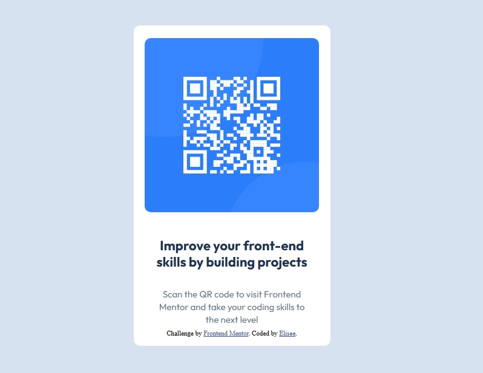

# Frontend Mentor - QR code component solution

This is a solution to the [QR code component challenge on Frontend Mentor](https://www.frontendmentor.io/challenges/qr-code-component-iux_sIO_H). 

## Table of contents

- [Overview](#overview)
  - [Screenshot](#screenshot)
  - [Links](#links)
- [My process](#my-process)
  - [Built with](#built-with)
  - [What I learned](#what-i-learned)
  - [Continued development](#continued-development)
  - [Useful resources](#useful-resources)
- [Author](#author)
- [Acknowledgments](#acknowledgments)

**Note: Delete this note and update the table of contents based on what sections you keep.**

## Overview

### Screenshot



### Links

- Solution URL: [Add solution URL here](https://github.com/Elisee7/qr-code-component.git)
- Live Site URL: [Add live site URL here](https://qr-code-component-beta-peach.vercel.app/)

## My process

### Built with

- Semantic HTML5 markup
- CSS custom properties
- Flexbox

### What I learned


```css
.card {
      ...
      display: flex;
      flex-direction: column;
      align-items: center;
      text-align: center;
    }

.margin-top-300 { margin-top: 24px; }      
.margin-bottom-500 { margin-bottom: 40px; }      
.margin-bottom-300 { margin-bottom: 24px; }  

.slate-300 {
      background-color: hsl(212, 45%, 89%);
    }


.slate-900 {
  color: hsl(218, 44%, 22%);
}

.slate-500 {
  color: hsl(216, 15%, 48%);
}

.text-preset-1 {
  font-family: 'Outfit', sans-serif;
  font-size: 22px;
  font-weight: 700; /* for bold */
  line-height: 120%;
  letter-spacing: 0px;
}

.text-preset-2 {
  font-family: 'Outfit', sans-serif;
  font-size: 15px;
  font-weight: 400; /* for normal */
  line-height: 140%;
  letter-spacing: 0px;
}
```
*** Note: I leart how to use flexbox and also I learned how to group elements into reusable classes and how to use design system in fontend projets ***


### Continued development

I want to continue focussing on how to design using design system.

### Useful resources

- [Chatgpt](https://www.chatgpt.com) - This helped me to understand the figma file and how to use design system. Also i use it to learn markdown concepts.

## Author

- Frontend Mentor - [@Elisee7](https://www.frontendmentor.io/profile/Elisee7)
- Twitter - [@nelisee7](https://x.com/nelisee7)
- LinkedIn - [@ELISEE](https://www.linkedin.com/in/elisee-nikiema-89906a324/)

